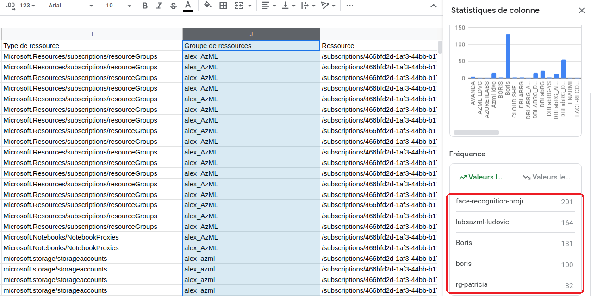

# brief-formateurs

Superviser la gestion des coûts de sa promotion dans le cadre de la préparation à la dp100.

La documentation pour ce projet ce trouve [ici](https://github.com/jtobelem-simplon/dp100-brief-init/blob/master/doc/dp100.pdf?raw=true).


## Configuration des utilisateurs
- une souscription dont le nom est celui de la promotion : ecole-ia-XXX
- un groupe (dans azure active directory) qui contient les membres (rôle:utilisateur) de la promo : ecole-ia-XXX-pXX (le numéro de promo)
- un groupe (dans azure AD) qui contient les formateurs (rôle:utilsateur) : ecole-ia-XXX-pXX-formateurs
- depuis le contrôle des accès (IAM), ajouter les groupes (rôle:contributeur) dans la souscription

## Configuration des ressources
- un groupe de ressource pour toute la promo par projet (par exemple prepadp100) afin de supprimer le groupe après passage de la certif
- un workspace pour la promo
- envoyer une demande (par mail + auto) au support pour augmenter le quota par défaut de 10 coeurs
- une instance de clacul de type ds11-v2 par personne
- un cluster de calcul (min = 0, max = 4) pour toute la promo

## Création d'alerte
- une alerte tous les 100€ pour contrôler que le budget mensuel ne déborde pas (il devrait être d'environ 400€ pour la dp100) 


## Script d'arret des machines pour une souscription
- à lancer de temps en temps (en rappelant à l'ordre les personnes qui n'aurait pas éteint leur machine)

```python
import os
from azureml.core.compute import ComputeTarget, AmlCompute, ComputeInstance
from azureml.core.compute_target import ComputeTargetException
from azureml.core import Workspace

subscription_id = os.environ.get("SUBSCRIPTION_ID", "XXX") #ID soubscription Azure
resource_group = os.environ.get("RESOURCE_GROUP", "dp100-resources") #Resource group

for ws_name in Workspace.list(subscription_id, resource_group=resource_group):
    ws = Workspace(subscription_id=subscription_id, resource_group=resource_group, workspace_name=ws_name)

    for compute in ComputeTarget.list(ws):
        print(">>>>", compute.name, "in", ws_name)
        if type(compute) is ComputeInstance and compute.get_status().state != 'Stopped':
            print('try to stop compute', compute.name)
            compute.stop(show_output=True)
```

## Identification des éléments qui pesent le plus sur le coût total
- afficher le journal d'activité de la souscription


- télécharger au format csv pour identifier les ressources les plus utilisées


## briefs apprenants

[installer l'environnement azure pour suivre le parcours d'apprentissage MS](https://github.com/jtobelem-simplon/dp100-brief-init.git)
[installer l'environnement local pour suivre le parcours d'apprentissage MS](https://github.com/jtobelem-simplon/dp100-brief-init-expert.git)
[cadre pour transposer les exercices du parcours d'apprentissage MS sur l'exemple du titanic](https://github.com/jtobelem-simplon/dp100-brief-titanic.git)